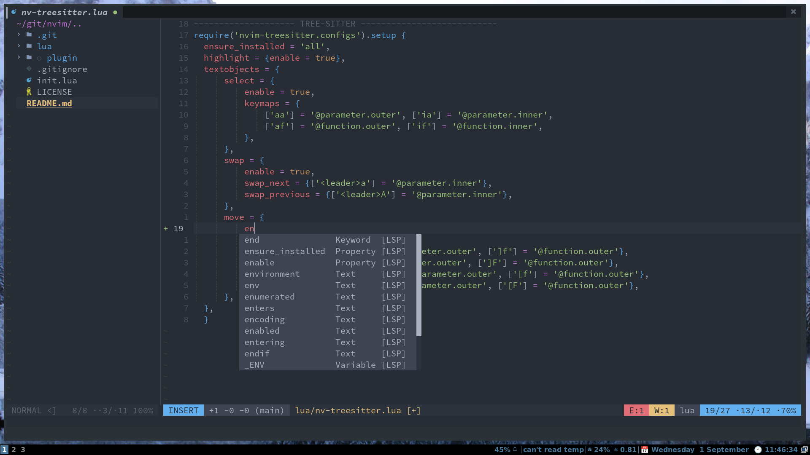

# Nvim 
Here's all my nvim config written in lua. I'm trying to make it minimal and easy to understand, it will evolve as my workflow evolve....

## Screenshot


## Installing

You will need `git`

Backup your old nvim config 

Clone into your `~/.config` directory

```bash
git clone https://github.com/VijayakumarRavi/nvim.git ~/.config
```

## Usage
The structure of this config is simple, inside the lua folder for the **keymaps** yo go to the config folders and edit the keys.lua file.

If you want to add a keymap you use:

```lua
map('i', '<c-u>', '<Esc>viwUi')
```
map('{mode}', '{shortcut}'. '{command}')
